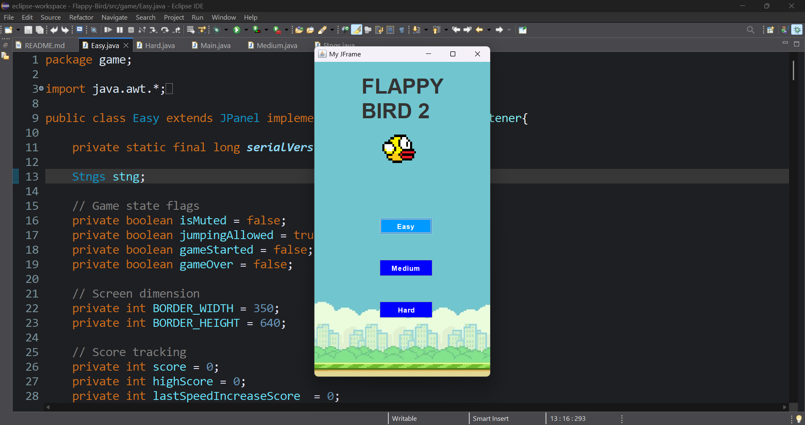
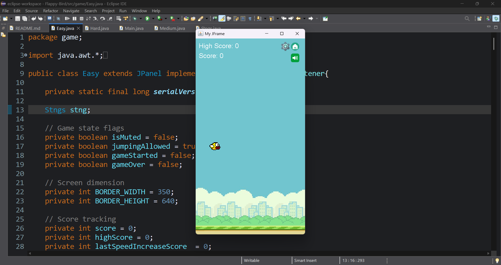

# Flappy Bird - Java Desktop Game

A desktop recreation of the classic **Flappy Bird** game developed using **Java (Swing + AWT)**.  
This project focuses on **game physics, collision detection, audio handling**, and **difficulty scaling** using a clean **object-oriented design**.

## Objective

The objective of this project is to build a fully playable Flappy Bird–style game while demonstrating:

- Gravity-based movement & jump physics  
- Smooth animation using a game loop  
- Accurate collision detection  
- Progressive difficulty levels  
- Proper resource management (images & sounds)

---

## Technologies Used

- **Language:** Java  
- **UI Framework:** Java Swing + AWT  
- **Audio:** `javax.sound.sampled` (Clip, AudioInputStream)  
- **Game Loop:** Timer-based loop  
- **IDE:** IntelliJ IDEA

---

## Gameplay Features

### Core Mechanics

* Smooth bird jump controlled by velocity and gravity
* Pipe obstacle generation with random vertical gaps
* Real-time collision detection
* Score system with live updates

---

### Audio & UI Features
* Background theme music  
* Coin sound on successful pipe pass  
* Death sound on collision  
** In-game Settings Panel: **
  - Mute / Unmute sound  
  - Return to Home screen  
  - Restart game  

All audio and image assets are loaded using **classpath-based resource handling**, ensuring compatibility in both IDE and packaged JAR files.

---

## Difficulty Levels

### Easy
- Static vertical pipes  
- Gradually increasing horizontal speed  
- Beginner-friendly gameplay  

### Medium
- Pipes move **up & down dynamically**  
- Increased speed scaling  
- Requires better timing & control  

### Hard (Work in Progress)
- Based on Medium mechanics  
- Planned features:
  - Enemy obstacles approaching from the front  
  - Higher reaction-time requirements  
  - Advanced collision logic
  
---

## Physics Logic (Overview)

* **Jump:** Implemented using upward velocity (`jumpPower`)  
* **Gravity:** Constant downward acceleration for smooth falling  
* **Speed Scaling:** Pipe speed increases after fixed score intervals  
* **Fair Difficulty:** Maximum speed is capped to avoid impossible gameplay  

---

### Home Screen

### Settings Panel

### Game Over Screen

